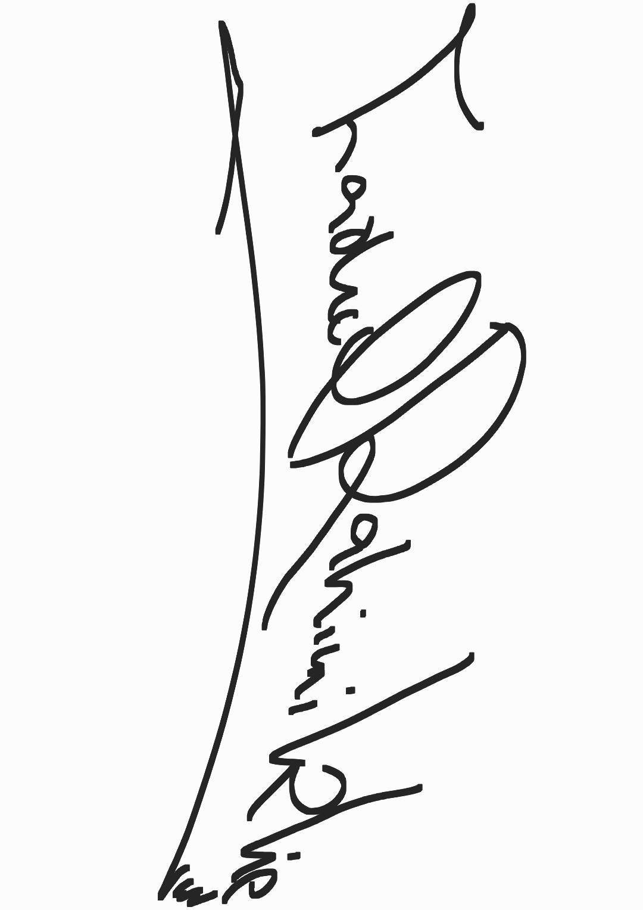

  

# 💫 About Me:
OLX website MERN Project React js project React js, Tailwend CSS, Express js, Mongo DB, Node js React js, javascript, front-end I am cool

## 🌐 Socials:
    

# 💻 Tech Stack:
                  
# 📊 GitHub Stats:
 
 

### ✍️ Random Dev Quote

### 🔝 Top Contributed Repo

---
 

  
<!-- Proudly created with GPRM ( https://gprm.itsvg.in ) -->
